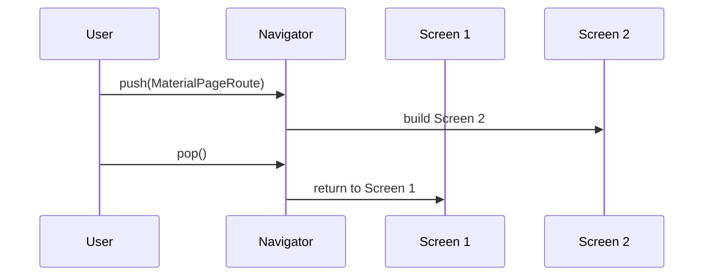

## Overview

Access the complete Flutter API reference to build performant, natively compiled applications for mobile, web, and desktop. You interact with core widgets like `Container` and `Text`, manage navigation with `Navigator`, handle state using `StatefulWidget`, and style interfaces with Material or Cupertino components.

<Columns cols={3}>
  <Card title="Core Widgets" icon="layout" href="#core-widgets">
    Essential building blocks with properties for layout and styling.
  </Card>
  <Card title="Navigation" icon="arrow-right" href="#navigation">
    Route between screens using `Navigator` APIs.
  </Card>
  <Card title="State Management" icon="settings" href="#state-management">
    Maintain app state with widgets and providers.
  </Card>
</Columns>

<Callout kind="info">
  Consult the [official Flutter docs](https://api.flutter.dev/) for the latest class definitions and consult `pub.dev` for package dependencies.
</Callout>

## Core Widgets

Core widgets form the foundation of your UI. Use `Container` for layout and decoration, `Text` for content display, and `Row`/`Column` for flexible arrangements.

### Container Widget Properties

<ParamField path="child" param-type="Widget?" required="false">
  The widget below this container in the tree.
</ParamField>

<ParamField path="color" param-type="Color?" required="false">
  Background color for the container.
</ParamField>

<ParamField path="width" param-type="double?" required="false">
  Fixed width constraint.
</ParamField>

<ParamField path="height" param-type="double?" required="false">
  Fixed height constraint.
</ParamField>

<CodeGroup tabs="Container Example">
  ```dart
  Container(
    width: 200,
    height: 100,
    color: Colors.blue,
    child: const Text('Hello Flutter'),
  )
  ```
</CodeGroup>

## Navigation and Routing

Navigate between screens using the `Navigator` class. Push new routes with `Navigator.push()` and pop with `Navigator.pop()`.



<Steps>
  <Step title="Push a Route" icon="arrow-right">
    ```dart
    Navigator.push(
      context,
      MaterialPageRoute(
        builder: (context) => SecondScreen(),
      ),
    );
    ```
  </Step>
  <Step title="Pop and Pass Data" icon="arrow-left">
    ```dart
    Navigator.pop(context, 'Data from screen');
    ```
  </Step>
</Steps>

## State Management Classes

Manage state with `StatefulWidget` for local changes and `InheritedWidget` for propagating data down the tree. For larger apps, integrate packages like `provider`.

<Tabs>
  <Tab title="StatefulWidget" icon="code">
    ```dart
    class Counter extends StatefulWidget {
      @override
      _CounterState createState() => _CounterState();
    }

    class _CounterState extends State<Counter> {
      int _count = 0;

      @override
      Widget build(BuildContext context) {
        return Text('Count: $_count');
      }
    }
    ```
  </Tab>
  <Tab title="setState Usage" icon="refresh-cw">
    <Callout kind="tip">
      Call `setState` to trigger rebuilds.
    </Callout>
    ```dart
    void _increment() {
      setState(() {
        _count++;
      });
    }
    ```
  </Tab>
</Tabs>

## Material and Cupertino Components

Flutter supports platform-adaptive designs. Use Material for Android-style apps and Cupertino for iOS.

<Tabs>
  <Tab title="Material Button" icon="smartphone">
    ```dart
    ElevatedButton(
      onPressed: () {},
      child: const Text('Material Button'),
    )
    ```
  </Tab>
  <Tab title="Cupertino Button" icon="apple">
    ```dart
    CupertinoButton(
      onPressed: () {},
      child: const Text('Cupertino Button'),
    )
    ```
  </Tab>
</Tabs>

<ResponseField name="child" field-type="Widget" required="true">
  The button's label or icon.
</ResponseField>

<ResponseField name="onPressed" field-type="VoidCallback?" required="true">
  Callback when pressed.
</ResponseField>

<Expandable title="Advanced Routing with Named Routes" default-open="false">
  Define routes in `MaterialApp`:

  ```dart
  MaterialApp(
    routes: {
      '/': (context) => HomeScreen(),
      '/details': (context) => DetailsScreen(),
    },
  )
  ```

  Navigate with `Navigator.pushNamed(context, '/details');`.
</Expandable>

<Callout kind="tip">
  Always wrap your app in `MaterialApp` or `CupertinoApp` for theming and navigation context.
</Callout>