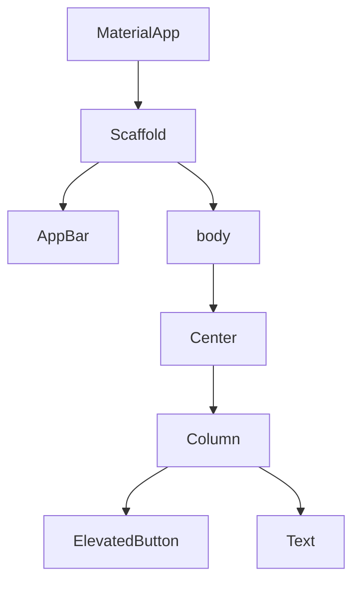

## Prerequisites

Before building your first Flutter app, ensure you have the following:

<Callout kind="info">
  - Flutter SDK installed (version `>=3.0.0`)
  - Dart SDK (included with Flutter)
  - An IDE like VS Code or Android Studio
  - Android/iOS emulator or physical device
</Callout>

Verify your setup by running `flutter doctor` in your terminal. Fix any issues it reports.

## Create a New Flutter Project

Follow these steps to scaffold your first app.

<Steps>
  <Step title="Install Flutter" icon="download">
    Choose your platform for installation instructions.

    <Tabs>
      <Tab title="macOS" icon="apple">
        ```bash
        brew install flutter
        ```
      </Tab>
      <Tab title="Windows" icon="monitor">
        Download from [flutter.dev](https://flutter.dev/docs/get-started/install/windows) and add to PATH.
      </Tab>
      <Tab title="Linux" icon="terminal">
        ```bash
        sudo snap install flutter --classic
        ```
      </Tab>
    </Tabs>
  </Step>

  <Step title="Create Project" icon="plus">
    Generate a new project in your desired directory.

    ```bash
    flutter create my_first_app
    cd my_first_app
    ```
  </Step>

  <Step title="Open in IDE" icon="code">
    Open the project folder in VS Code or Android Studio for editing.
  </Step>
</Steps>

## Understand the Widget Tree

Flutter apps are built using a tree of widgets. Everything is a widget: layouts, buttons, text, and even the app itself.

The root widget is `MaterialApp`, which sets up the app's material design theme. It contains a `Scaffold` for basic layout structure.

Here's a simple widget tree diagram:



Examine the default `lib/main.dart` file:

<CodeGroup tabs="main.dart">
  ```dart
  import 'package:flutter/material.dart';

  void main() {
    runApp(const MyApp());
  }

  class MyApp extends StatelessWidget {
    const MyApp({super.key});

    @override
    Widget build(BuildContext context) {
      return MaterialApp(
        title: 'Flutter Demo',
        theme: ThemeData(
          primarySwatch: Colors.blue,
        ),
        home: const MyHomePage(title: 'Flutter Demo Home Page'),
      );
    }
  }

  class MyHomePage extends StatefulWidget {
    const MyHomePage({super.key, required this.title});

    final String title;

    @override
    State<MyHomePage> createState() => _MyHomePageState();
  }

  class _MyHomePageState extends State<MyHomePage> {
    int _counter = 0;

    void _incrementCounter() {
      setState(() {
        _counter++;
      });
    }

    @override
    Widget build(BuildContext context) {
      return Scaffold(
        appBar: AppBar(
          title: Text(widget.title),
        ),
        body: Center(
          child: Column(
            mainAxisAlignment: MainAxisAlignment.center,
            children: <Widget>[
              const Text('You have pushed the button this many times:'),
              Text(
                '$_counter',
                style: Theme.of(context).textTheme.headlineMedium,
              ),
            ],
          ),
        ),
        floatingActionButton: FloatingActionButton(
          onPressed: _incrementCounter,
          tooltip: 'Increment',
          child: const Icon(Icons.add),
        ),
      );
    }
  }
  ```
</CodeGroup>

This structure shows a stateful counter app. The `build` method returns the widget tree.

## Run Your App

Connect an emulator or device, then launch the app.

<Tabs>
  <Tab title="Emulator" icon="smartphone">
    <Steps>
      <Step title="Start Emulator">
        Open Android Studio > AVD Manager > Launch emulator.
      </Step>
      <Step title="Run App">
        ```bash
        flutter run
        ```
      </Step>
    </Steps>
  </Tab>

  <Tab title="Physical Device" icon="tablet">
    Enable developer mode and USB debugging on your device.

    ```bash
    flutter devices
    flutter run -d <device-id>
    ```
  </Tab>
</Tabs>

## Hot Reload and Debugging

Flutter's hot reload updates your app in `<1s` without losing state. Press `r` in the terminal during `flutter run`.

<Callout kind="tip">
  Use VS Code's debugger or `flutter logs` for issues. Set breakpoints in Dart code for step-through debugging.
</Callout>

For production builds:

```bash
flutter build apk  # Android
flutter build ios  # iOS (macOS only)
```

## Next Steps

<Columns cols={3}>
  <Card title="Explore Widgets" icon="package" href="/widgets">
    Dive into `Container`, `Row`, `Column`, and more layout widgets.
  </Card>

  <Card title="State Management" icon="git-branch" href="/state-management">
    Learn `Provider`, `Riverpod`, or `Bloc` for app state.
  </Card>

  <Card title="Navigation" icon="arrow-right" href="/navigation">
    Implement routes and `Navigator` for multi-screen apps.
  </Card>
</Columns>

<Expandable title="Troubleshooting Common Issues" default-open="false">
  - **No devices found**: Run `flutter doctor` and set up emulator.
  - **Build errors**: Ensure Dart SDK path is correct.
  - **Hot reload fails**: Stop and restart `flutter run`.
</Expandable>